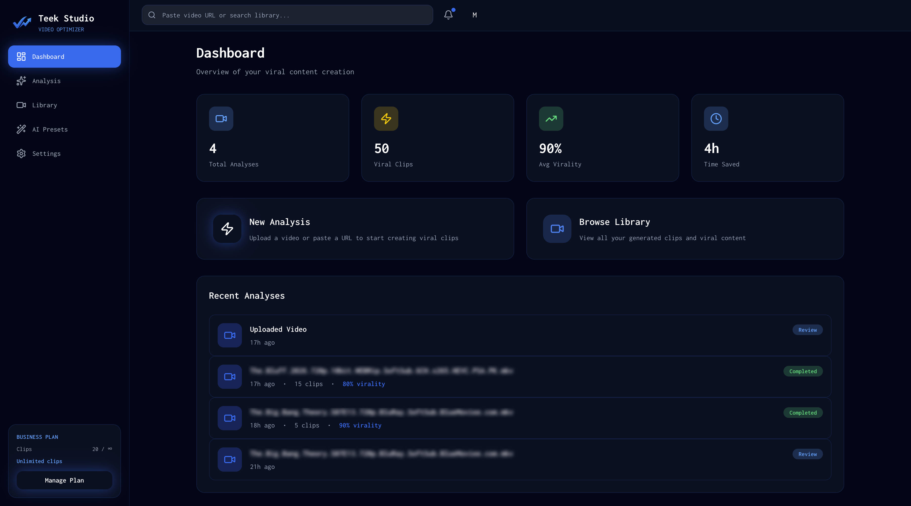
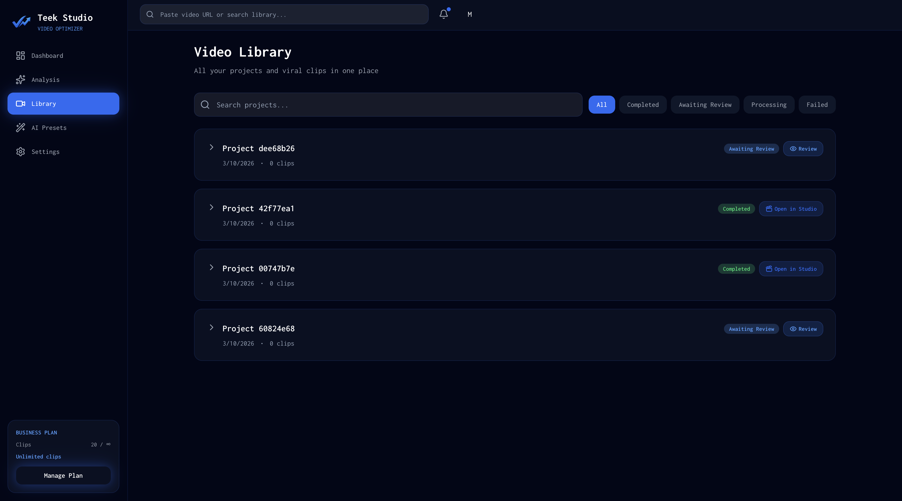
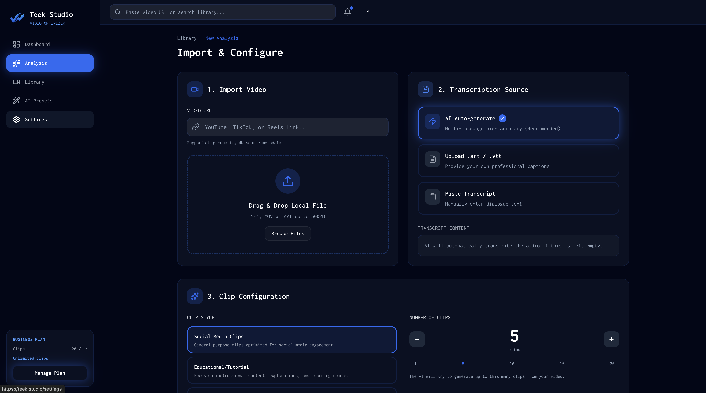
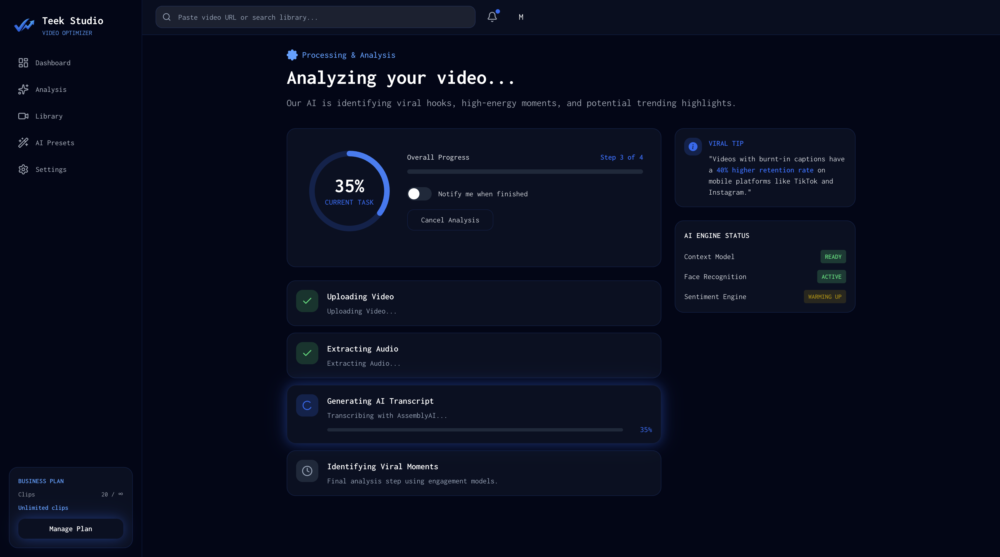
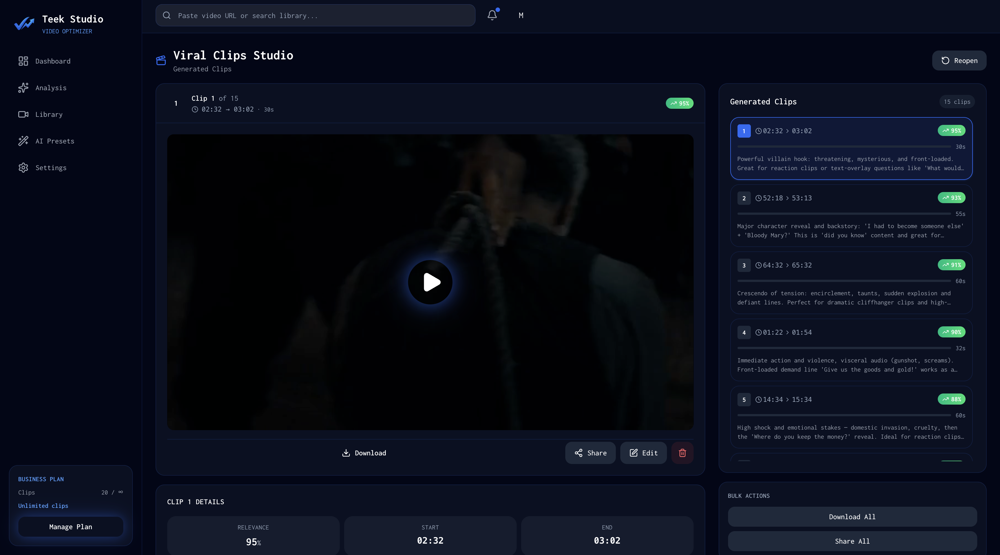
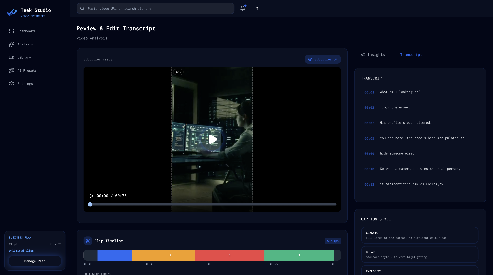
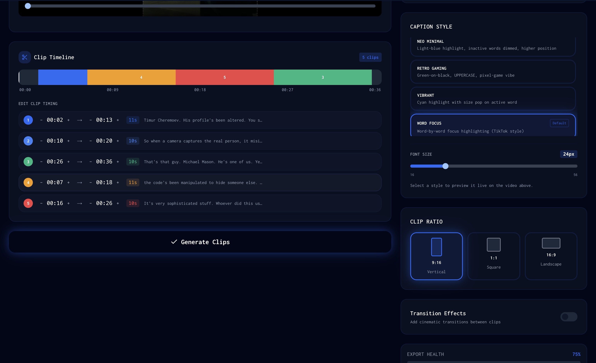

# Teek

Open-source AI video clipping, built as a self-hosted alternative to OpusClip, Veed.io, caption.com.

This repo is based on the SupoClip repo (https://github.com/FujiwaraChoki/supoclip), which is a self-hosted alternative to OpusClip.

... because good video clips shouldn't cost a fortune or come with ugly watermarks.

OpusClip charges $15-29/month and slaps watermarks on every free video. SupoClip gives you the same AI-powered video clipping capabilities - completely free, completely open source, and completely watermark-free, while still providing you with a hosted version, that doesn't cost the same amount as your mortgage.

## Teek vs OpusClip

| Feature | Teek | OpusClip |
|---|---|---|
| Caption styles | Multiple styles (classic, hype, retro, minimalist, and more) | Limited presets, paid tiers unlock more |
| Clip aspect ratio / cutting ratio | Configurable per clip | Fixed 9:16, no control |
| Automatic face detection | Yes — MediaPipe + OpenCV fallback, no cloud dependency | Yes — cloud-based, behind paid plan |
| Review clips & adjust duration | Yes — trim start/end in the editor | Basic trim, paid plans only |
| Review clips against original video | Yes — side-by-side with source video timeline | No |
| Subscription / plan management | Self-hosted, no subscription required | $15–29/month, watermarks on free tier |
| Transcription providers | Whisper (local), AssemblyAI, or import your own SRT | Proprietary only, no external provider |
| RTL language support | Full RTL support via ASS subtitle engine | Partial / broken in most modes |
| AI clip selection model | Any LLM (OpenAI, Anthropic, Google, ZhipuAI, …) | Fixed proprietary model |
| Watermarks | None | Always on free tier |
| Open source | Yes (AGPL-3.0) | No |
| Self-hosted | Yes | No |

## Screenshots

| | |
|---|---|
|  |  |
|  |  |
|  |  |
|  | |

## What This Repo Contains

- `backend/`: FastAPI service for transcription, clip analysis, and video rendering
- `frontend/`: Next.js app for task creation and clip management
- `docker-compose.yml`: local full-stack orchestration

## 60-Second Local Start

```bash
cp .env.sample .env
# edit .env and add one model provider key (OPENAI_API_KEY or GOOGLE_API_KEY or ANTHROPIC_API_KEY or ZAI_API_KEY)
# transcription defaults to local Whisper; set TRANSCRIPTION_PROVIDER=assemblyai only if you want remote transcription
./start.sh
```

Then open:
- Frontend: `http://${APP_HOST}:${FRONTEND_HOST_PORT}` (default `http://localhost:3000`)
- Backend API: `http://${APP_HOST}:${BACKEND_HOST_PORT}` (default `http://localhost:8000`)
- API docs: `http://${APP_HOST}:${BACKEND_HOST_PORT}/docs` (default `http://localhost:8000/docs`)

## Documentation Map

- Quick start and troubleshooting: `QUICKSTART.md`
- Canonical config reference: `docs/config.md`
- Local URL/port mapping reference: `docs/local-host-mappings.md`
- Agent/project-state guide: `AGENTS.md`
- Claude compatibility guide: `CLAUDE.md`
- Backend-specific development notes: `backend/README.md`

## Model And Runtime Defaults

- Default LLM: `openai:gpt-5-mini`
- Preferred model env var: `LLM`
- Legacy model env var still accepted: `LLM_MODEL`
- Preferred Whisper env var: `WHISPER_MODEL_SIZE`
- Legacy Whisper env var still accepted: `WHISPER_MODEL`
- Frontend local runtime: Node.js `20+` / npm `10+` (`frontend/.nvmrc`)

## Backend Entrypoints

- Docker/default path: `src.main_refactored:app`
- Legacy local path: `src.main:app`

## Current Risks / Known Gaps

- Runtime quality depends on model/provider behavior and prompt consistency.
- No lightweight model regression/eval suite is currently documented.
- Repository is actively changing; keep docs aligned via `docs/config.md`.

## License

AGPL-3.0. See `LICENSE`.
